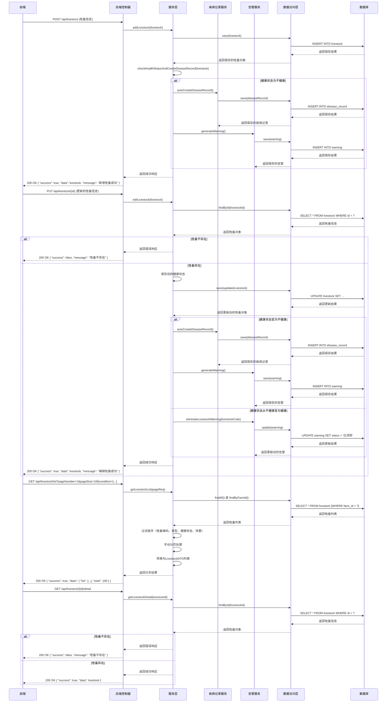

# 牲畜管理模块功能时序图指令

## 1. 牲畜管理模块核心功能时序图

### 1.1 生成条件
- 包含前端、后端、服务层、数据层的完整交互流程
- 展示核心功能：添加牲畜、编辑牲畜、获取牲畜列表、获取牲畜详情
- 展示健康状态变化时的自动处理流程
- 包含异常处理和告警生成

### 1.2 具体指令

### 1.3 时序图说明

1. **添加牲畜流程**：
   - 前端发送POST请求到后端控制器
   - 控制器调用服务层的addLivestock方法
   - 服务层保存牲畜信息到数据库
   - 服务层检查健康状态，如果不健康则自动创建疾病记录并生成告警
   - 返回成功响应给前端

2. **编辑牲畜流程**：
   - 前端发送PUT请求到后端控制器
   - 控制器调用服务层的editLivestock方法
   - 服务层检查牲畜是否存在
   - 保存更新后的牲畜信息
   - 根据健康状态变化处理：
     - 健康状态变为不健康：创建疾病记录并生成告警
     - 健康状态从不健康变为健康：消除告警
   - 返回响应给前端

3. **获取牲畜列表流程**：
   - 前端发送GET请求到后端控制器，包含分页和过滤条件
   - 控制器调用服务层的getLivestockList方法
   - 服务层从数据库获取牲畜列表
   - 服务层根据条件过滤和手动分页
   - 转换为DTO列表并返回分页结果
   - 返回响应给前端

4. **获取牲畜详情流程**：
   - 前端发送GET请求到后端控制器
   - 控制器调用服务层的getLivestockDetail方法
   - 服务层检查牲畜是否存在
   - 返回牲畜详情给前端

### 1.4 技术要点

1. **健康状态自动处理**：当牲畜健康状态变为不健康时，系统自动创建疾病记录并生成告警，实现了智能化的健康管理。

2. **事务处理**：添加和编辑牲畜操作都使用了@Transactional注解，确保数据一致性。

3. **分页和过滤**：实现了手动分页和多条件过滤功能，提高了数据查询的灵活性。

4. **异常处理**：当牲畜不存在时，返回错误信息给前端，提高了系统的用户体验。

5. **告警管理**：当牲畜健康状态异常时生成告警，恢复健康时消除告警，实现了完整的告警生命周期管理。