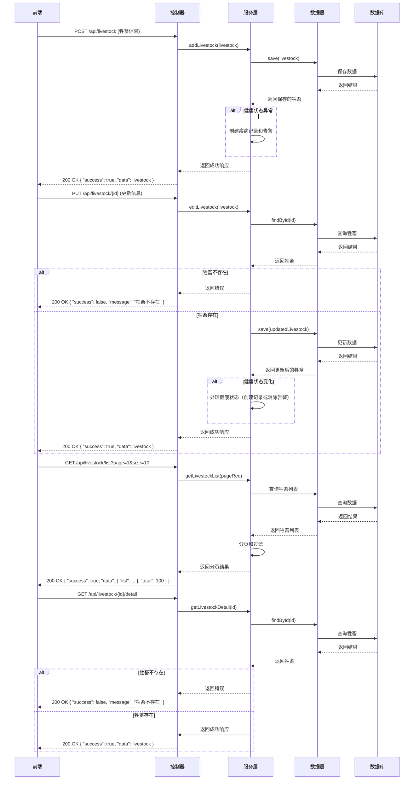

# 牲畜管理模块功能时序图指令（简化版）

## 1. 牲畜管理模块核心功能时序图

### 1.1 生成条件
- 展示核心功能的主要流程
- 包含前端、后端、服务层和数据层
- 突出健康状态处理逻辑

### 1.2 具体指令

### 1.3 时序图说明

1. **添加牲畜**：前端发送请求，后端保存数据，检查健康状态并处理异常情况。

2. **编辑牲畜**：前端发送更新请求，后端检查牲畜是否存在，更新数据，处理健康状态变化。

3. **获取牲畜列表**：前端发送分页请求，后端查询数据，进行分页和过滤后返回结果。

4. **获取牲畜详情**：前端发送详情请求，后端查询并返回牲畜信息。

### 1.4 核心功能点

- **健康状态管理**：自动处理健康状态异常，创建疾病记录和告警。
- **数据操作**：完整的CRUD操作支持。
- **分页查询**：支持分页和条件过滤。
- **错误处理**：处理牲畜不存在等异常情况。